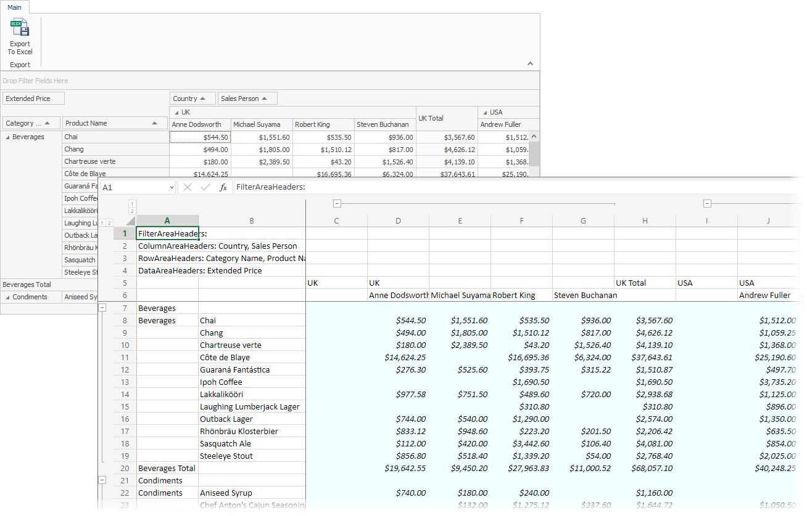

<!-- default badges list -->

<!-- default badges end -->

# Pivot Grid for WinForms - Сustomize Сells in the Exported Excel Document

The following example shows how to customize cells appearance in the exported document when you export the Pivot Grid to XLSX (or XLS) format. In this example, custom appearance settings (the azure background and italic font) are applied to the cells that correspond to the Pivot Grid's data area. 

## Files to Review

[Form1.cs](./CS/WinPivotExportCustomizeCell/Form1.cs) (VB: [Form1.vb](./VB/WinPivotExportCustomizeCell/Form1.vb))

## Example Overview

Handle the [PivotXlsxExportOptions.CustomizeCell](https://docs.devexpress.com/WindowsForms/DevExpress.XtraPivotGrid.PivotXlsxExportOptions.CustomizeCell) or [PivotXlsExportOptions.CustomizeCell](https://docs.devexpress.com/WindowsForms/DevExpress.XtraPivotGrid.PivotXlsExportOptions.CustomizeCell) event to customize cells appearance in the exported document. 

Use the [e.ExportArea](https://docs.devexpress.com/WindowsForms/DevExpress.XtraPivotGrid.CustomizePivotCellEventArgs.ExportArea) property to identify the cell location in the exported Excel document. The [e.Formatting](https://docs.devexpress.com/WindowsForms/DevExpress.XtraPivotGrid.CustomizePivotCellEventArgs.Formatting) property sets the cell format. 

## Documentation

- [Exporting](https://docs.devexpress.com/WindowsForms/1800/controls-and-libraries/pivot-grid/printing-and-exporting/exporting)
- [Data Area](https://docs.devexpress.com/WindowsForms/1693/controls-and-libraries/pivot-grid/ui-elements/data-area)

## More Examples

[WinForms - How to Print a Document that Contains Pivot and Chart Controls](https://github.com/DevExpress-Examples/winforms-print-pivot-and-chart-controls)

